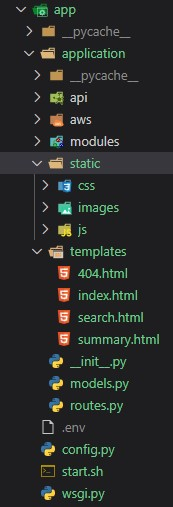

<h1>Building your first Machine Learning Web Application</h1>

<h2>Introduction</h2>

<h3>Prelude</h3>

As a Machine Learning Consultant, I had the privilege of working on different projects.
Clients often have different requests, they sometimes want just a package they can use as a swappable backend, but sometimes they want either a web application or a mobile application and in the beginning I tried to do everything by myself but I simply wasn't able to get things done on time because of the learning curve. This was because I wanted to learn something new with every project both on the Machine Learning side and the Software Engineering side so things became tough to manage so I hired two engineers to help me whenever I needed to build either a mobile or a web application. But I still wanted to learn how to do it by myself so I learned full stack web development and built my personal website (Website link) this is version 2.0 and my blogging website (website link).

There were a lot of resources on how to build web applications but not so much when you want to build a web application with a python backend, deployed in AWS which uses their services and uses Machine Learning. I knew I was asking a lot but this is a summary/tips/guide, pretty much everything that I thought a Machine Learning Engineer with a Python background would need to learn and build a Scalable Machine Learning Web Application end to end. So let's get started

<h3>User Requirements</h3>

Before building or writing any code, you need to clearly define the user story, and you should not move forward until you have one because this is where most mistakes happen in software development, misunderstanding what needs to be built.

Make sure you understand the features, what you are building and how a user will be using your application. Talking of user story, if you are not sure what that means or how to write one, I have taken few software engineering / development courses, if you are interested

- [Software Design and Architecture Specialization](https://www.coursera.org/specializations/software-design-architecture)
- [Software Development Lifecycle Specialization](https://www.coursera.org/specializations/software-development-lifecycle)

You don't really need to take the course to understand what I am going to talk about but if you are a learner and looking for something to learn, I would highly recommend those courses.

But to understand things better in this article and some of my design choices, I would recommend the smaller LinkedIn course: [Programming Foundations: Object-Oriented Design](https://www.linkedin.com/learning/programming-foundations-object-oriented-design-3/learn-object-oriented-design-principles) which you will have to pay if you don't have a pro account.

For the rest of the article I am going to link a bunch of LinkedIn courses, just because they are short in duration, you get a nice certificate to share on your LinkedIn but like I said, you might have to pay but if you don't want to, take a look at the course topics which I link and google, it might not be well put together but you still would be able to find what you are looking for and I will try to link as many free resources as possible.

Below is a few software principles I used to start the project, btw I use this in my work a lot so again, I highly recommend taking a course on software development or in the least on Object Oriented Programming. Even if you don't end up building something end to end, it will make you a better programmer.

- Write User Story (Add link to User story)
- Gather requirement
- Describe the application
- Identify the main objects
- Describe the interactions
- High level UML Component diagram (Link to the Component Diagram)
- Draw Use Case diagram (Link to Use Case Diagram)

All the architectures you see and you will see are first hand drawn and then I transfer it to digital using online tools. I will name the tools as we go into further design. The one above is just using powerpoint.

<h3>Architecture</h3>

Based on my user story, below is a very high level architecture on what components I will have. Note that this is the inference architecture, more on it later.

When you are developing a software there is a right way of doing things and a wrong way of doing it but there isn't one right way of doing it so below is a description of the architecture that I am using and what I think would make more sense for first timers.

So, as you know, machine learning has a train component and a inference component and you can separate the train and inference component. All you need to make inference are the weights of your model. So, what I am going to build things incrementally and think of the Machine Learning components as black boxes. I only need to know what its going to take in and what its going to give out for now. Since one of the requirements is to use AWS, there might be models that already does this and I don't even need to worry about training, and you can get predictions by using APIs.

If you see the architecture, it can clearly be broken down to three or four components, text extraction, summarization, question and answer, chatbot. Since I want to build things incrementally I first need to build the skeleton of my application, the front end and the Flask interface so after I build a component I can test its functionality and if everything's satisfying I then move to the next component. This works nicely if you follow an object oriented approach when writing your python components.

<h3>Learning</h3>

Before I start any client project, I spend a week or two depending on the size of the project and my background knowledge learning about the state of the art models and about any services I would need to use in the project. Similarly, for this project, I am new to AWS and Flask so the first week I am going to split into two and go through AWS Services and how to work with Flask.

Btw when you are learning a library, spend time depending on how much time you would spend writing code using it. So, if you wanna build a web app or a dynamic web site using JavaScript, you gotta spend some time. Take a look at (JavaScript in 30 days). But if you are probably going to write a function to download a pdf from url, spend an hour looking for how to do it, if there are optimized ways of doing it and if you find a library, what other functionalities does the library provide.

For Flask since its going to act as an interface and I already know front end development, I just needed to learn how it will work with AWS and some basic functionalities. So I looked for 1 hour videos and a bunch of blogs to get different views of Flask, to see what's possible I both looked at easy and advanced Flask stuff. But didn't really go in deep, though I am sure you can do it. But, I just don't want you to spend time learning way more than what you need cause specially me, I forget what I don't use.

I am also not going to just start learning everything in the AWS side, so I am going to just look into services that AWS offers that I think I can use and make a note of it. Then go step by step while building the components and dive deep into it.

So as I build these components my basic architecture will keep updating and evolving. Some may disagree with my approach but I prefer building evolving software architectures that grows with time and is flexible enough to adapt. Specially in the Machine Learning world things are growing so fast, there seems to be better ways of doing things every month. But I've found that when you look for flexibility, you sometimes tradeoff usability so I make sure I pick components that allow me to

1. Scalability
2. Interchangeable
3. Security

(Write the three main things to build a software)

at any point. And make sure you study the components you are using even if it takes some time to learn these stuff, please do, you will save a lot of time in the end rewriting things, spending a lot of money and ultimately build an app that can scale.

<h3>Cost</h3>

Speaking of money, since I am using some paid services, I need to make an initial rough cost of acquisition of a new customer, so below is a calculation for that.

(Cost Calculation)

Note that when you are working with clients this is something you definitely have to spend time on. I usually spend more time on calculating an accurate cost than the time I spend on this project cause I usually would have an idea what I am going to use to build my project, for example like the AWS service cost. So, the calculation you see here is updated ones based on AWS services.

<h3>Content</h3>

The following article is separated into three sections.
1. Section 1: Steps: Include pretty much what it sounds like, my end to end process in building this app
2. Section 2: Inference Engine: Has details on individual scripts I wrote and helpful tips on problems I ran into and how I solved
3. Section 3: Train Engine: Is same as Inference Engine except it has details about he training component.

Note that I try to build this like someone without any background but something that seems intuitive for me might not be for someone so if some design choices I make doesn't make sense, look ahead, I might have linked some resources and if it still doesn't make sense, please feel free to reach out. I love hearing from you, I might take some time to get back to you because of my tight schedule but I will definitely get back to you.

<h2>Steps</h2>

<h3>Inference Engine</h3>

Below is a first draft inference engine architecture. Note that the more I learn about Flask and AWS, I would keep updating it.

First of all I am going to start with the UI, I am already familiar with front end development so this should be easy. If you wanna learn web development, I highly recommend [The Complete 2020 Web Development Bootcamp](https://www.udemy.com/course/the-complete-web-development-bootcamp/), she is an awesome teacher and for a beginner you can learn tons.

Before building the UI I hand drew how the pages would look like based on the basic functionality. There are tons of free UI designer tools and I usually prefer those when I am building something for a client just so I can present things properly but I always start with a rough hand drawn sketch.  Btw, I am not a UI designer and this is a simple web app so 😉, below is how the UI I built looks like.

I used [Namecheap Free Logo Maker](https://www.namecheap.com/logo-maker/) to design the logo. Namecheap is where I bought all my domain names so if you are looking to buy one, I highly recommend them.

The UI you see here is just static, to make it functional like to enable searching arXiv and routing queries I need to write either JavaScript or python code and use Flask. But I didn't want to call the server first and then route the request to arXiv api and then read the request from the server and post the results to client. So, I chose to write JavaScript code that'll work on the client side.

The Complete 2020 Web Development Bootcamp teaches you upto say intermediate JavaScript and that would be enough to build some basic functionality needed for this app but to make for example an arXiv search work with reasonable latency and render the results, you need to know little bit of advanced JavaScript. I would recommend the [JavaScript in 30 Days]() I put together that will teach you everything from basic to advanced with exercises and examples or if you are familiar with basic JavaScript, you can take a look at the following LinkedIn course that can be useful to build something like what I did:

- [Building Web Applications with Ajax](https://www.linkedin.com/learning/building-web-applications-with-ajax/welcome)
- [JavaScript and AJAX: Integration Techniques](https://www.linkedin.com/learning/javascript-and-ajax-integration-techniques/welcome)

The JavaScript code isn't optimized yet, meaning, I am making asynchronous queries but loading all the results at the same time. I haven't seen a lag for queries upto 100 results but if it ends up being more I would need to optimize it but for a MVP I am not too worried, this is one of the things in my TO DO list. Btw if you are using VS Code, there is a nice extension called [Better Comments](https://marketplace.visualstudio.com/items?itemName=aaron-bond.better-comments) it'll highlight your code comments, check it out 😉.

Now that my app can search and present results, next I need to download and summarize the paper based on what the user selects. So before diving into the summarization, since the request to summarize will be made using Flask, I am going to learn about Flask and using Flask with AWS:

- [Flask for Beginners Tutorial - Learn Flask in 40 Minutes](https://www.youtube.com/watch?v=EnJKHVEzHFw)

I looked into other Flask tutorials and courses but they are too simple and even the ones that say they are advanced didn't really solve the problems I was having setting up my workflow so below are some tutorials that I used that helped me in this project. That being said the more basic ones are good for getting started but not really for big production-ready software applications.

- [Demystifying Flask’s Application Factory](https://hackersandslackers.com/flask-application-factory/)

- [Organizing Flask Apps with Blueprints](https://hackersandslackers.com/flask-blueprints/)

- [Configuring Your Flask App](https://hackersandslackers.com/configure-flask-applications/)

- [The Art of Routing in Flask](https://hackersandslackers.com/flask-routes/)

Based on what I learned, below is how I set up my app folder:

Setting up the folder structure might seem like a minor thing if you are a newbie but trust me, its not as easy as it seems and you wanna make sure you get it right because this is basically the blueprint of your app, the roadmap of where to start, how things will work and interact. That being said, there isn't one universal way of structuring the folders. It will depend on the type of [programming paradigm](https://cs.lmu.edu/~ray/notes/paradigms/) and [software design]() paradigm you will follow and also on some requirements of the framework you use.

This is basically my setup for the inference engine, will show my train engine folder structure later.

Since everything upto my search works using JavaScript, all I needed to setup were the routes in the Flask side so next, I will look into how I can deploy a Flask app in AWS.

(AWS Flask Links)

After going through all the Flask stuff, this is what I am going to use Flask for:
-
-
-
-

Based on my Flask requirements, below is a sequence diagram:

(Flask Sequence diagram, take inspiration from: https://www.freecodecamp.org/news/cjn-understanding-mean-stack-through-diagrams/)

Then download the selected file and store it in S3 bucket. After it is stored, I need to call the pdf to text extractor which would have to read the file from S3 so there is going to be I/O latency but I suspect it won't be as bad.

Now that we are closing in on the Machine Learning Stuff, I wanna see what kind of Machine Learning Services does Amazon provide so I can leverage that. I am going to look at it now cause if it already has text summarization and a chatbot, I don't have to worry about training the models just yet.

- [Amazon Web Services Machine Learning Essential Training](https://www.linkedin.com/learning/amazon-web-services-machine-learning-essential-training/welcome)

Next the pdf to text extraction using ...................... . I initially wrote the text extraction in python using pdfminer but later when I looked into AWS services, I came across their text extractor, you can read more about it in [Section 2: Inference Engine](). For my purposes of just extracting the text, the AWS textractor and my textractor gave the same results but Amazons' textractor comes with other functionality like extracting images and tables, so if I choose to use those to help my summarizer later, it would be easy so I am going with AWS textractor for now with the tradeoff of cost. Below is my modified inference architecture with the AWS textractor component. Note that I am just showing only the extraction component.

(AWS textractor architecture)

Next I send the extracted text through a text cleaner to do some basic cleaning like removing the title, equations and the reference section. (I need to check this with abstract and reference keywords in the paper and see how it works)

Below is a database where I am going to store some meta data that could be later used for making my model better:
1. Paper title
2. Link extracted paper (S3 bucket link)
3. Link to cleaned paper (S3 bucket link)
4. Link to paper summary (S3 bucket link)
5. Link to question and answer (S3 bucket link)
6. Link to chatbots chat (S3 bucket)
7. Chatbot rating
8. Chatbot comments
8. Summary rating

Based on what I learned,

I started with the arXiv scrapper, then the pdf to text converter, followed by a text cleaner that cleans the initial text and groups things on paragraphs. I initially thought of building a layout recognition and text recognition engine that would work for all types of research documents but wanted to build something simple and easy that works and afterwards I can work on it to improve. This brings to my approach of building modular packages. Basically, a object oriented approach so if I need to swap things out I would easily be able to. Specially the machine learning components. So below is how I laid out the structure. Btw the easiest first step in following a object oriented approach is to take some time to come up with how to format things (I need to change the word format). Simply, before starting I would spend some time on creating the correct folders and python files that you think would be needed, Spend some time naming them, you don't have to write any code, just name them and draw how the files will interact with one another.

(Python Folder Structure)

Note that I did my UML Class Diagrams in a paper so not sharing it here, but if you want to learn about UML class diagrams and a free tool to draw some UML diagrams take a look at (Link). For those not familiar with UML class diagrams, below is a sample picture:

(UML Class diagram example)

Without going into detail UML Class diagrams describe a class's' properties and methods. Its an easy way to visualize and design how your classes are going to interact with each other and there are other types of UML diagrams you can use in your work. Take a look at [here](). You don't need to know a lot of UML stuff, just the basics to put your idea in paper and have a roadmap would be more than good enough, and even though there are softwares to help draw UML diagrams, I still prefer a paper and converting it into digital format later if it needs to be shared.

Now, that I have a way of downloading the pdf based on a query, I want to build a simple UI that would work. But before that, the most important part of building a software, testing.

I can't stress this enough, please write unit and integration test at the least. If you see my folder structure, when I created the files, I also made sure to create test files and before I start writing another module. What I will do now is, write test for my scrapper and converter and cleaner functions. After testing the functions individually which is appropriately called Functional Testing, I will put these in the unit_test file and see if they function completely as a file, this can only be done if you follow an object oriented approach and set up your files and modules correctly.

Next I would write the component test, for example the first component we built was the text_extraction module so I will test if that works as it should and put it under the text_extraction class. I will follow a similar approach to all the python related stuff. Note that people may have different names for the types of testing I mentioned, all you need to understand is the basic concepts of it and why you need to do it. And if this is your first time to testing, please see the links below:

(Software Testing Types Links)

- [Types Of Software Testing: Different Testing Types With Details](https://www.softwaretestinghelp.com/types-of-software-testing/)

So, if you had noticed my testing file, there was a integration testing file, which is what I am going to use to test if two components or more work together as they should. For example, like does my front end and back end communicate properly.

I then went into AWS, learned how the services will interact with each other and what services AWS has in general. Below are links I used to learn about AWS services:

(AWS Services link)

- [Amazon Web Services: Exploring Business Solutions](https://www.linkedin.com/learning/amazon-web-services-exploring-business-solutions/planning-aws-machine-learning-solution). You don't need to go through the whole course, you can just view the Machine Learning on AWS section.

- [Amazon Web Services Machine Learning Essential Training](https://www.linkedin.com/learning/amazon-web-services-machine-learning-essential-training/welcome) : Another LinkedIn course but for this one, go through everything.

I think I am going to move my inference related stuff completely into the app folder and have it separate and then have src only have things related to training. That way I can manage the two different deployments, the scaling needed for inference, and use the Machine Learning side as black boxes where I just get data from using APIs and I can integrate the AWS Chatbot and the like and it would be easier to scale. So, text extractor should be moved to app.

Now, that I have a complete idea for the inference engine, below is my complete inference architecture with all the AWS components

(Complete inference architecture image)

***

<h3>Training Engine</h3>

Now, to actually make the inference, I need the machine learning components, my speciality 😉. So below is my initial training architecture

(Training architecture image)

Make sure you write logs to collect parameters, results, application identifier and timestamps in the log file. You need to keep track of what papers were requested to be summarized, the basic routes it went through, whether the output was stored and timestamps on how long the process took and various endpoints it went through so later I can optimize these endpoints and limit the routing.

Note that in the training machine learning architecture there are a lot of services I can use for example to tune my architecture, monitor performance and so on and I will add AWS and other services stage by stage when we go deeper into the training and deploying. But if this is your first time to deploying Machine Learning models and scaling, I also found the following course in LinkedIn:

- [Deploying Scalable Machine Learning for Data Science](https://www.linkedin.com/learning/deploying-scalable-machine-learning-for-data-science/scaling-ml-models)

- [DevOps for Data Scientists](https://www.linkedin.com/learning/devops-for-data-scientists/welcome)

So below is my deployment architecture:

(Training Deployment architecture image)

System Testing, is where I test my overall system based on user requirements.

My APIs for the Machine Learning models and how they are going to communicate with my Inference Engine:

(API Architecture)

I am going to use [Swagger](https://swagger.io/) to generate documentation for my API.

I also need to write memory profiler for my machine learning models and store that data when I run training in the cloud, see if there are easy tools for that in the cloud or whether I have to write one.

***

<h3>Deploy</h3>

When deploying, focus on monitoring tools. You need to be able to detect issues before your customers do so try to incorporate monitoring tools. The ones I am going to focus on are,

1. Application performance, which I am achieving through logs
2. Container performance, I am going to use docker stats and store the data in a database
3. Kubernetes Cluster through their API

Now we are ready to deploy. We can start by containerizing the inference engine:

(Inference Engine to be containerized image)

Below are some links on how to write a Dockerfile.

Note that since I have different requirements for my inference and train engine, I am thinking of creating two separate docker images.

(Train Engine to be containerized image)

Note that I also need to set up a system so I can get the ratings of the summaries and chats and store it and use that to tune my model later. So, I need a database to store these and below is an update architecture of the training and inference architecture with the database.

(Updated Machine Learning Training and inference Architecture image)

Now, storing the summaries isn't enough, usually machine learning model performance decays with time if you don't retrain it with new labels, its just the time of decay will be different so what I am going to do is. Create some tasks where I store x amount of summaries and user ratings, then get the summaries and create an Amazon Mechanical Turk Job where you label the summaries and once it labels, I will create a new job to retrain my model with the new data. I don't have to train from scratch or using all the data though this is debatable as to which gives better performance. You can experiment and use whichever works best for you, it will also depend on the training cost so, I will just use transfer learning and retrain with the new data so as to customize my model. Below is my Full Training Inference architecture.

(Updated Joined Training and inference Architecture image)

I also want to use some automated tools to automate version controlling my data and models, automating testing of the models and updates.

I also need to use certain monitoring tools proposed by dev ops principles like setting up pings for monitoring the health of my containers and clusters and check the usage.

After Deploying, get customer feedback. How much are you willing to pay to use this per month, what additional features would you like to see.

I have to write a script to collect quality control data so I can use that to test how a newer version of the model performs, basically AB testing.

Set up your docker container to monitor the application. Make sure it collects CPU utilization, Memory utilization, Disk performance information, which includes both the rate of IO block information and disk utilization, also monitor the network and understand the level of IO traffic on the network. The docker stats provides a live stream of data but it is not persistent so I have to set up a database to store this data.

***

<h3>Scaling</h3>

Scaling is not a one time action like you know deploying or your app going live, scaling is continuous. Its just managing your resources and since those resources will not always be same, scaling becomes a challenge.

I need to set up a load balancing system that is able to auto scale.

(Papyri Scaling Architecture image)

I am going to use Kubernetes to scale.

***

<h2>Inference Engine</h2>

<h3>Text Extractor</h3>

- Make sure you have a logger and save the log files, it'll be helpful in future (Write about why logging is helpful).

A logger can help you monitor the performance of your application.

__arXiv Scrapper__

Found a nice library called [arxiv](https://github.com/lukasschwab/arxiv.py) to scrape arxiv papers. I am not installing it, borrowed the script and modified  it to my need. Didn't need some of the extra bells and whistles and modified it to fit my need.

- I can use [this](https://github.com/Mahdisadjadi/arxivscraper) to add a time component where you can scrape from certain date to date

__pdf extractor__

Tried PyPDF2 and it was crap. And don't install pdfminer, nor pdfminer.six, the correct version is [pdfminer3](https://github.com/gwk/pdfminer3) but this sometimes might get installed in the wrong folder so, I just took the pdf2txt.py script that comes with it. You can find it in Scripts under the Anaconda env folder you are using. I will also highly recommend using anaconda to manage your packages cause when I tried to install pdfminer instead of pdfminer3 by accident, pdfminer tried to remove tensorflow 2 so before installing, make sure you look at which packages will be installed, upgraded or removed before saying yes to install a new package and you can only do this if you are installing using conda and not pip3. Note that I also tried slate3k but the extraction is not good at all even though they say it is from pdfminer.

- The extract_text from pdfminer3 wasn't there so I thought I'll just copy the files and modify it. The reason it the I/O cost of reading the files and saving it to the s3 bucket. And since the text size is pretty small, I can just keep things in memory and process it.

- From stack overflow:

Best thing for text extraction from PDFs is [TET](https://www.pdflib.com/), the text extraction toolkit. TET is part of the PDFlib.com family of products. But PDFlib TET can be evaluated without a license, but will only process PDF documents with up to 10 pages and 1 MB size unless a valid license key is applied. For some other solutions, which are pretty good, take a look at [this](https://stackoverflow.com/questions/3650957/how-to-extract-text-from-a-pdf)

__Notes__

I want to start with an easy solution, that is why I am going with a pdf extractor route, in the later versions, I am thinking of removing this and doing some layout analysis and extracting text from that.

I also found later when I started going through AWS services that they have a text extractor that does OCR so I am thinking of using that.

<h3>Flask App</h3>

<h3>AWS Components</h3>

<h3>Machine Learning APIs</h3>

<h3>Containerization</h3>

<h3>Scaling</h3>

<h2>Train Engine</h2>

<h3>Text Summarizer</h3>

<h3>Question Answering</h3>

<h3>Chatbot</h3>

<h3>Training</h3>

<h3>APIs</h3>

<h3>Tuning</h3>

<h3>Monitoring</h3>
